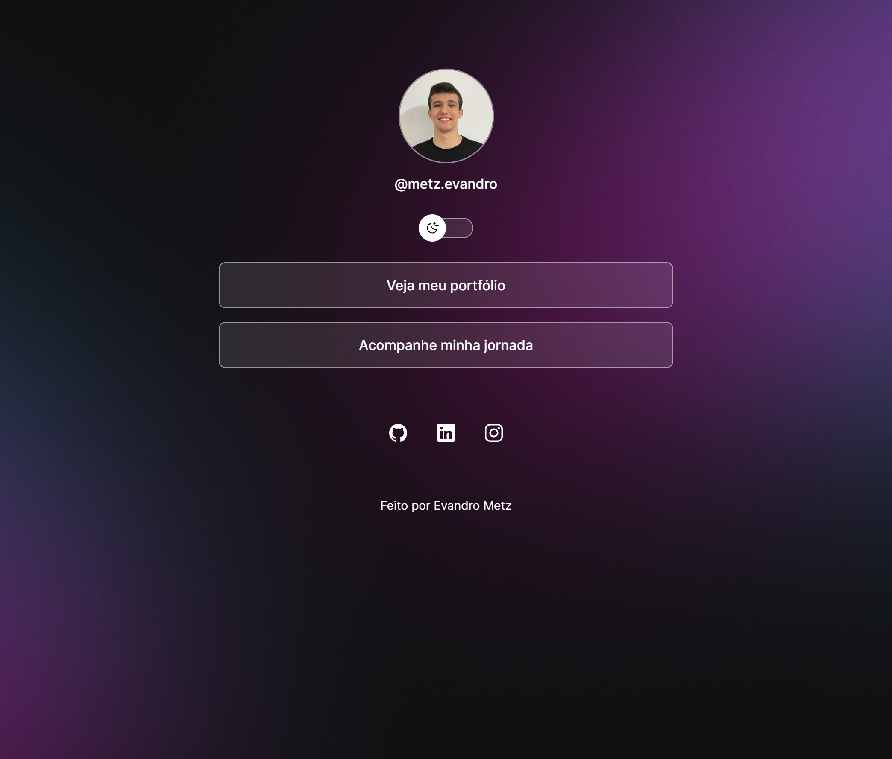

  

  <a href="#sobre">Sobre</a> •
  <a href="#tecnologias">Tecnologias</a> •
  <a href="#autor">Autor</a>  

## Sobre

Projeto desenvolvido com a ajuda do curso DevLink da Rocketseat, com certificado.

Tendo sua função interligar as redes sociais, facilitando o acesso de identificação. Possui, além disso, alteração do modo de cores, para o estilo dark ou light.

[🔗Clique aqui para acessar o site](https://metzevandro.vercel.app/)
## Tecnologias 

  • <a href="https://developer.mozilla.org/pt-BR/docs/Web/JavaScript">JavaScript</a> 
  • <a href="https://developer.mozilla.org/pt-BR/docs/Web/CSS">CSS</a>
  • <a href="https://developer.mozilla.org/pt-BR/docs/Web/HTML">HTML</a>
  • <a href="https://github.com/">GitHub</a> 
  • <a href="https://git-scm.com/">Git</a> 

## Autor

<h1>Evandro Metz</h1>
<strong>Frontend Developer</strong>
 
 

 
 

